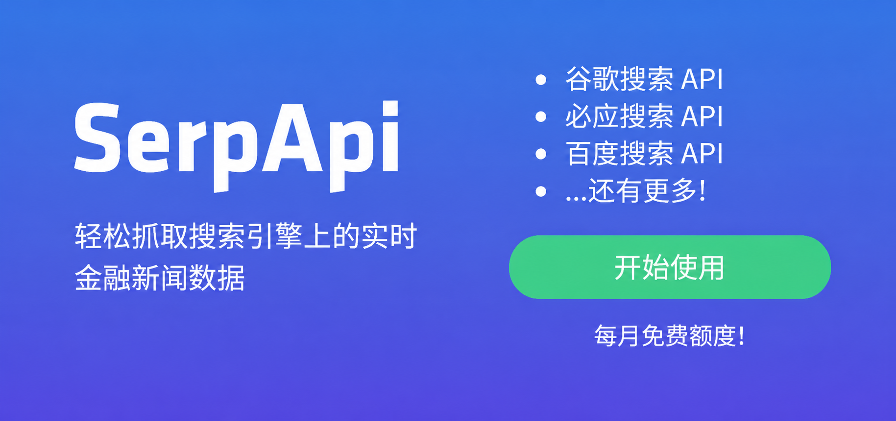

<div align="center">

# 股票智能分析系統

[](https://github.com/ZhuLinsen/daily_stock_analysis/stargazers)
[](https://github.com/ZhuLinsen/daily_stock_analysis/actions/workflows/ci.yml)
[](https://opensource.org/licenses/MIT)
[](https://www.python.org/downloads/)
[](https://github.com/features/actions)
[](https://hub.docker.com/)

<p align="center">
  &nbsp;<a href="https://hellogithub.com/repository/ZhuLinsen/daily_stock_analysis" target="_blank"></a>
</p>

**基於 AI 大模型的 A股/港股/美股/日股/韓股/台股自選股智能分析系統**

自動分析自選股 → 生成決策儀表盤 → 多渠道推送（Telegram/Discord/Slack/郵件/企業微信/飛書）

**零成本部署** · GitHub Actions 免費運行 · 無需伺服器

[**產品預覽**](#-產品預覽) · [**功能特性**](#-功能特性) · [**快速開始**](#-快速開始) · [**推送效果**](#-推送效果) · [**文檔中心**](./INDEX.md) · [**完整指南**](./full-guide.md)

 繁體中文 | [English](README_EN.md) | [简体中文](../README.md)

</div>

## 💖 贊助商 (Sponsors)

<div align="center">
  <p align="center">
    <a href="https://open.anspire.cn/?share_code=QFBC0FYC" target="_blank"></a>
    <a href="https://serpapi.com/baidu-search-api?utm_source=github_daily_stock_analysis" target="_blank"></a>
  </p>
</div>

## 🖥️ 產品預覽

<p align="center">
  
</p>

## ✨ 功能特性

| 能力 | 覆蓋內容 |
|------|------|
| AI 決策報告 | 核心結論、評分、趨勢、買賣點位、風險警報、催化因素、操作檢查清單 |
| 多市場數據聚合 | 覆蓋 A股、港股、美股、日股、韓股、台股和 ETF，支援行情、K 線、技術指標、新聞、公告、基本面與報告輔助數據；不同市場的數據源和能力邊界見 [市場支持邊界](market-support.md) |
| Web / 桌面工作台 | 手動分析、任務進度、歷史報告、完整 Markdown、回測、持倉、配置管理、淺色 / 深色主題 |
| Agent 策略問股 | 多輪追問，支援均線、纏論、波浪、趨勢、熱點、事件、成長、預期等 15 種內建策略，覆蓋 Web/Bot/API |
| 智能匯入與補全 | 圖片、CSV/Excel、剪貼簿匯入；股票代碼/名稱/拼音/別名補全 |
| 自動化與推送 | GitHub Actions、Docker、本地定時任務、FastAPI 服務和企業微信/飛書/Telegram/Discord/Slack/郵件推送 |

> 功能細節、欄位契約、基本面 P0 超時語義、交易紀律、數據源優先級、Web/API 行為請看 [完整配置與部署指南](./full-guide.md)。

### 技術棧與數據來源

| 類型 | 支援 |
|------|------|
| AI 模型 | [Anspire](https://open.anspire.cn/?share_code=QFBC0FYC)、[AIHubMix](https://aihubmix.com/?aff=CfMq)、Gemini、OpenAI 兼容、DeepSeek、通義千問、Claude、Ollama 本地模型等 |
| 行情數據 | [TickFlow](https://tickflow.org/auth/register?ref=WDSGSPS5XC)、AkShare、Tushare、Pytdx、Baostock、YFinance、Longbridge |
| 新聞搜尋 | [Anspire](https://open.anspire.cn/?share_code=QFBC0FYC)、[SerpAPI](https://serpapi.com/baidu-search-api?utm_source=github_daily_stock_analysis)、[Tavily](https://tavily.com/)、[Bocha](https://open.bocha.cn/)、[Brave](https://brave.com/search/api/)、[MiniMax](https://platform.minimaxi.com/)、SearXNG |
| 社交輿情 | [Stock Sentiment API](https://api.adanos.org/docs)（Reddit / X / Polymarket，僅美股，可選） |

> **長橋優先策略（僅美／港股）**：在已設定 `LONGBRIDGE_APP_KEY` / `LONGBRIDGE_APP_SECRET` / `LONGBRIDGE_ACCESS_TOKEN` 的前提下，美股與港股的 **日線** 與 **即時行情** 由 **Longbridge 優先**；長橋失敗或欄位不足時再由 **YFinance／AkShare** 兜底或合併補欄。**未設定長橋憑證時不會呼叫 Longbridge**，美／港股仍以 YFinance／AkShare 為主（與未整合長橋前一致）。**美股大盤指數**始終以 YFinance 優先（長橋不提供指數行情）。**A 股**路由不變。詳見 `.env.example` 與 [完整指南](./full-guide.md)。

### 內建交易紀律

| 規則 | 說明 |
|------|------|
| 嚴禁追高 | 乖離率 > 5% 自動提示風險 |
| 趨勢交易 | MA5 > MA10 > MA20 多頭排列 |
| 精確點位 | 買入價、止損價、目標價 |
| 檢查清單 | 每項條件以「符合 / 注意 / 不符合」標記 |

## 🚀 快速開始

### 方式一：[GitHub Actions（推薦）](https://www.bilibili.com/video/BV11FEb66EXG/)

**無需服務器，每天自動運行！**

#### 1. Fork 本倉庫

點擊右上角 `Fork` 按鈕（順便點個 Star 支持一下）

#### 2. 配置 Secrets

進入你 Fork 的倉庫 → `Settings` → `Secrets and variables` → `Actions` → `New repository secret`

**AI 模型配置（二選一）**

預設先選一個模型服務商並填寫 API Key；需要多模型、圖片識別、本地模型或高級路由時，再參考 [LLM 配置指南](./LLM_CONFIG_GUIDE.md)。

| Secret 名稱 | 說明 | 必填 |
|-------------|------|:----:|
| `ANSPIRE_API_KEYS` | [Anspire](https://open.anspire.cn/?share_code=QFBC0FYC) API Key，一 Key 同時啟用全球熱門大模型和聯網搜尋，含本項目免費額度 | **推薦** |
| `AIHUBMIX_KEY` | [AIHubMix](https://aihubmix.com/?aff=CfMq) API Key，一 Key 切換使用全系模型，本項目可享 10% 優惠 | **推薦** |
| `GEMINI_API_KEY` | Google Gemini API Key | 可選 |
| `ANTHROPIC_API_KEY` | Anthropic Claude API Key | 可選 |
| `OPENAI_API_KEY` | OpenAI 兼容 API Key（支援 DeepSeek、通義千問等） | 可選 |
| `OPENAI_BASE_URL` / `OPENAI_MODEL` | 使用 OpenAI 兼容服務時填寫 | 可選 |

> *注：`GEMINI_API_KEY` 和 `OPENAI_API_KEY` 至少配置一個

<details>
<summary><b>通知渠道配置</b>（點擊展開，至少配置一個）</summary>

| Secret 名稱 | 說明 | 必填 |
|-------------|------|:----:|
| `STOCK_LIST` | 自選股代碼，如 `600519,hk00700,AAPL,7203.T,005930.KS,2330.TW` | ✅ |

**新聞源配置（推薦）**

新聞源會顯著影響輿情、公告、事件和催化因素品質，建議至少配置一個搜尋服務。

| Secret 名稱 | 說明 | 必填 |
|-------------|------|:----:|
| `ANSPIRE_API_KEYS` | [Anspire AI Search](https://aisearch.anspire.cn/)：中文內容特別優化，可增強 A 股分析效果；同一 Key 也可作為 Anspire 大模型網關兜底示例 | **推薦** |
| `SERPAPI_API_KEYS` | [SerpAPI](https://serpapi.com/baidu-search-api?utm_source=github_daily_stock_analysis)：搜尋引擎結果補強，適合即時金融新聞 | **推薦** |
| `TAVILY_API_KEYS` | [Tavily](https://tavily.com/)：通用新聞搜尋 API | 可選 |
| `BOCHA_API_KEYS` | [博查搜尋](https://open.bocha.cn/)：中文搜尋優化，支援 AI 摘要 | 可選 |
| `BRAVE_API_KEYS` | [Brave Search](https://brave.com/search/api/)：隱私優先，美股資訊補強 | 可選 |
| `MINIMAX_API_KEYS` | [MiniMax](https://platform.minimaxi.com/)：結構化搜尋結果 | 可選 |
| `SEARXNG_BASE_URLS` | SearXNG 自建實例：無配額兜底，適合私有部署 | 可選 |

更多搜尋源、社交輿情和降級規則見 [搜尋服務配置](./full-guide.md#搜索服务配置)。

**行情數據源配置（可選）**

> 預設使用 AkShare、Baostock、YFinance 等免費數據源，日誌中「未配置」的提示不影響執行。
> 如需更穩定的行情，可按市場配置以下 Secret：

| Secret 名稱 | 適用市場 | 說明 |
|-------------|:--------:|------|
| `TUSHARE_TOKEN` | A 股 | 提升歷史行情穩定性 |
| `LONGBRIDGE_OAUTH_CLIENT_ID` + `LONGBRIDGE_OAUTH_TOKEN_CACHE_B64` | 港股/美股 | 補齊量比、換手率、PE 等欄位 |

> 詳見 [數據源配置](./full-guide.md#数据源配置)。

#### 3. 啟用 Actions

進入 `Actions` 標籤 → 點擊 `I understand my workflows, go ahead and enable them`

#### 4. 手動測試

`Actions` → `每日股票分析` → `Run workflow` → 選擇模式 → `Run workflow`

#### 5. 完成！

默認每個工作日 **18:00（北京時間）** 自動執行

> 斷點續傳與 `--dry-run` 的資料存在性判斷，現在會按股票所屬市場的本地時區與交易日曆解析「最新可復用交易日」；週末 / 節假日會復用最近交易日，交易日盤中會復用上一個已完成交易日，盤後若當日資料已落庫則可直接跳過。詳細規則見 [完整配置指南](./full-guide.md)。

### 方式二：[客戶端配置教程](https://www.bilibili.com/video/BV11FEb66Eyr/) / 本地運行 / Docker 部署

```bash
# 克隆項目
git clone https://github.com/ZhuLinsen/daily_stock_analysis.git && cd daily_stock_analysis

# 安裝依賴
pip install -r requirements.txt

# 配置環境變數
cp .env.example .env && vim .env

# 運行分析
python main.py
```

常用命令：

```bash
python main.py --debug
python main.py --dry-run
python main.py --stocks 600519,hk00700,AAPL,2330.TW
python main.py --market-review
python main.py --schedule
python main.py --serve-only
```

> Docker 部署、定時任務、雲端伺服器訪問請參考 [完整指南](./full-guide.md)；桌面客戶端打包請參考 [桌面端打包說明](./desktop-package.md)。

## 📱 推送效果

### 決策儀表盤
```
📊 2026-01-10 決策儀表盤
3隻股票 | 🟢買入:1 🟡觀望:2 🔴賣出:0

🟢 買入 | 貴州茅台(600519)
📌 縮量回踩MA5支撐，乖離率1.2%處於最佳買點
💰 狙擊: 買入1800 | 止損1750 | 目標1900
✅多頭排列 ✅乖離安全 ✅量能配合

🟡 觀望 | 寧德時代(300750)
📌 乖離率7.8%超過5%警戒線，嚴禁追高
⚠️ 等待回調至MA5附近再考慮

---
生成時間: 18:00
```

### 大盤復盤

```
🎯 2026-01-10 大盤復盤

📊 主要指數
- 上證指數: 3250.12 (🟢+0.85%)
- 深證成指: 10521.36 (🟢+1.02%)
- 創業板指: 2156.78 (🟢+1.35%)

📈 市場概況
上漲: 3920 | 下跌: 1349 | 漲停: 155 | 跌停: 3

🔥 板塊表現
領漲: 互聯網服務、文化傳媒、小金屬
領跌: 保險、航空機場、光伏設備
```

## 配置說明

> 📖 完整環境變量、定時任務配置請參考 [完整配置指南](./full-guide.md)

## 🧩 FastAPI Web 服務（可選）

Web 工作台提供配置管理、任務監控、手動分析、歷史報告、完整 Markdown 報告、Agent 問股、回測、持倉管理、智能匯入和淺色 / 深色主題。啟動方式：

```

訪問 `http://127.0.0.1:8000` 即可使用。認證、智能匯入、搜尋補全、歷史報告複製、雲端伺服器訪問等細節見 [本地 WebUI 管理介面](./full-guide.md#本地-webui-管理界面)。

## 🤖 Agent 策略問股

配置任意可用 AI API Key 後，Web `/chat` 頁面即可使用策略問股；如需顯式關閉可設定 `AGENT_MODE=false`。

- 支援均線金叉、纏論、波浪理論、多頭趨勢、熱點題材、事件驅動、成長品質、預期重估等內建策略
- 支援即時行情、K 線、技術指標、新聞和風險資訊調用
- 支援多輪追問、會話匯出、發送到通知渠道和後台執行
- 支援自訂策略文件與多 Agent 編排（實驗性）

> Agent 具體參數、`skill` 命名兼容、多 Agent 模式和預算護欄見 [完整指南](./full-guide.md#本地-webui-管理界面) 與 [LLM 配置指南](./LLM_CONFIG_GUIDE.md)。

## 🧩 相關項目 (Related Projects)

> DSA 聚焦日常分析報告；以下兩個同系列項目分別覆蓋選股、策略驗證與策略進化，適合按需延伸使用。它們目前獨立維護，後續會優先探索與 DSA 的候選股導入、回測驗證和報告聯動。

| 項目 | 定位 |
|------|------|
| [AlphaSift](https://github.com/ZhuLinsen/alphasift) | 多因子選股與全市場掃描，用於從股票池中整理候選標的 |
| [AlphaEvo](https://github.com/ZhuLinsen/alphaevo) | 策略回測與自我進化，用於驗證策略規則，並透過迭代探索策略參數與組合 |

## 📬 聯繫與合作

<table>
  <tr>
    <td width="92" valign="top"><strong>合作郵箱</strong></td>
    <td valign="top">
      <a href="mailto:zhuls345@gmail.com">zhuls345@gmail.com</a><br>
      項目諮詢、部署支援與功能擴展
    </td>
    <td align="center" rowspan="3" valign="middle" width="148">
      <a href="http://xhslink.com/m/tU520DWCKT" target="_blank"></a><br>
      <sub>掃碼關注小紅書</sub>
    </td>
  </tr>
  <tr>
    <td width="92" valign="top"><strong>小紅書</strong></td>
    <td valign="top"><a href="http://xhslink.com/m/tU520DWCKT">歡迎關注小紅書</a></td>
  </tr>
  <tr>
    <td width="92" valign="top"><strong>問題反饋</strong></td>
    <td valign="top"><a href="https://github.com/ZhuLinsen/daily_stock_analysis/issues">提交 Issue</a></td>
  </tr>
</table>

## 📄 License

## License
[MIT License](../LICENSE) © 2026 ZhuLinsen

如果你在項目中使用或基於本項目進行二次開發，非常歡迎在 README 或文檔中註明來源並附上本倉庫鏈接。

## ⚠️ 免責聲明

本項目僅供學習和研究使用，不構成任何投資建議。股市有風險，投資需謹慎。作者不對使用本項目產生的任何損失負責。

---
