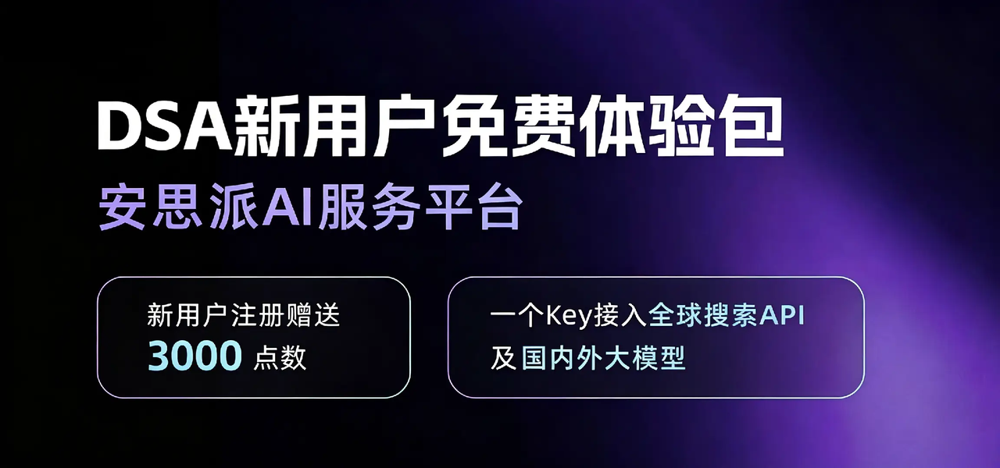

<div align="center">

# AI Stock Analysis System

[](https://github.com/ZhuLinsen/daily_stock_analysis/stargazers)
[](https://arxiv.org/abs/2608.26990)
[](https://github.com/ZhuLinsen/daily_stock_analysis/actions/workflows/ci.yml)
[](https://opensource.org/licenses/MIT)
[](https://www.python.org/downloads/)
[](https://github.com/features/actions)
[](https://hub.docker.com/)

<p align="center">
  &nbsp;<a href="https://hellogithub.com/repository/ZhuLinsen/daily_stock_analysis" target="_blank"></a>
</p>

**AI-powered stock analysis system for A-shares / Hong Kong / US / Japanese / Korean / Taiwan stocks**

Analyze your watchlist daily → generate a decision dashboard → push to multiple channels (Telegram/Discord/Slack/Email/WeChat Work/Feishu)

[**Product Preview**](#-product-preview) · [**Key Features**](#-key-features) · [**Quick Start**](#-quick-start) · [**Sample Output**](#-sample-output) · [**Documentation Index**](./INDEX_EN.md) · [**Full Guide**](./full-guide_EN.md)

English | [简体中文](../README.md) | [繁體中文](README_CHT.md)

</div>

## 💖 Sponsors

<div align="center">
  <p align="center">
    <a href="https://open.anspire.cn/?share_code=QFBC0FYC" target="_blank"></a>
    <a href="https://serpapi.com/github-daily-stock-analysis" target="_blank"></a>
  </p>
</div>

## 🖥️ Product Preview

<p align="center">
  
</p>

## ✨ Key Features

| Capability | Coverage |
|------------|----------|
| AI decision reports | Core conclusion, score, trend, entry/exit levels, risk alerts, catalysts, and action checklist |
| Multi-market data | Covers A-shares, Hong Kong, US, Japanese, Korean, Taiwan stocks, and ETFs, with quotes, K-lines, technical indicators, news, announcements, fundamentals, and report context. Data-source coverage and market boundaries are documented in [market boundaries](market-support.md) |
| Web / desktop workspace | Manual analysis, task progress, history, full Markdown reports, backtest, portfolio, settings, and light/dark themes |
| Agent strategy chat | Multi-turn Q&A with 15 built-in strategies across Web/Bot/API |
| Smart import & autocomplete | Image, CSV/Excel, clipboard import; code/name/pinyin/alias autocomplete |
| Automation & notifications | GitHub Actions, Docker, local scheduler, FastAPI service, and WeChat Work / Feishu / Telegram / Discord / Slack / Email delivery |

> The Backtest page now includes a 1-day next-session validation view. You can filter by stock code and analysis date range to compare the original AI prediction with the next trading day close and inspect the filtered accuracy rate. This is based on historical analysis plus `eval_window_days=1` backtest data, not real trade execution logs.

### Tech Stack & Data Sources

| Type | Supported |
|------|-----------|
| AI Models | [Anspire](https://open.anspire.cn/?share_code=QFBC0FYC), [AIHubMix](https://inferera.com/?aff=CfMq), Gemini, OpenAI-compatible providers, DeepSeek, Qwen, Claude, Ollama |
| Market Data | [TickFlow](https://tickflow.org/auth/register?ref=WDSGSPS5XC), AkShare, Tushare, Pytdx, Baostock, YFinance, Longbridge |
| News Search | [Anspire](https://open.anspire.cn/?share_code=QFBC0FYC), [SerpAPI](https://serpapi.com/github-daily-stock-analysis), [Tavily](https://tavily.com/), [Bocha](https://open.bocha.cn/), [Brave](https://brave.com/search/api/), [MiniMax](https://platform.minimaxi.com/), SearXNG |
| Social Sentiment | [Stock Sentiment API](https://api.adanos.org/docs) for Reddit / X / Polymarket, US stocks only |

> The project includes free market-data sources such as AkShare, Baostock, and YFinance and can run without extra data-source credentials. These free sources can be rate-limited, change upstream contracts, or fluctuate by network condition, so stability is not guaranteed. For scheduled runs, batch analysis, or steadier quotes, configure token-based sources such as TickFlow, Tushare, or Longbridge; market coverage, Actions mappings, and fallback rules are documented in [Data Source Configuration](./full-guide_EN.md#data-source-configuration).

> **Longbridge-first (US/HK only):** With `LONGBRIDGE_APP_KEY` / `LONGBRIDGE_APP_SECRET` / `LONGBRIDGE_ACCESS_TOKEN` set, **daily bars and realtime quotes** for US & HK stocks are fetched from **Longbridge first**; **YFinance / AkShare** are used for **fallback** or **field merge** when Longbridge fails or returns incomplete fields. **If Longbridge is not configured, it is not called** — US/HK still use YFinance / AkShare as before. **US market indices** (e.g. SPX) always prefer **YFinance** (indices are not supported on Longbridge). **A-share** routing is unchanged. See `.env.example` and the [full guide](./full-guide_EN.md).

### Built-in Trading Rules

| Rule | Description |
|------|-------------|
| No chasing highs | Auto warn when deviation > 5% |
| Trend trading | Bull alignment: MA5 > MA10 > MA20 |
| Precise levels | Entry, stop loss, target |
| Checklist | Each condition marked as Pass / Watch / Fail |

## 🚀 Quick Start

### Option 1: GitHub Actions (Recommended, Zero Cost)

**No server needed, runs automatically every day!**

#### 1. Fork this repository

Click the `Fork` button in the upper right corner

#### 2. Configure Secrets

Go to your forked repo → `Settings` → `Secrets and variables` → `Actions` → `New repository secret`

**AI Model Configuration (Choose one)**

Start with one provider and one API key. For multi-model routing, image recognition, local models, or advanced routing, see the [LLM Config Guide](./LLM_CONFIG_GUIDE_EN.md).

| Secret Name | Description | Required |
|-------------|-------------|:--------:|
| `ANSPIRE_API_KEYS` | [Anspire](https://open.anspire.cn/?share_code=QFBC0FYC) API key, one key for popular LLMs and web search with free quota for this project | **Recommended** |
| `AIHUBMIX_KEY` | [AIHubMix](https://inferera.com/?aff=CfMq) API key, one key for multiple model families and a 10% top-up discount for this project | **Recommended** |
| `GEMINI_API_KEY` | Google Gemini API key | Optional |
| `ANTHROPIC_API_KEY` | Anthropic Claude API key | Optional |
| `OPENAI_API_KEY` | OpenAI-compatible API key, including DeepSeek and Qwen-compatible services | Optional |
| `OPENAI_BASE_URL` / `OPENAI_MODEL` | Fill these when using an OpenAI-compatible provider | Optional |

> *Note: Configure at least one of `GEMINI_API_KEY`, `OPENAI_API_KEY`, or `OLLAMA_API_BASE` (local). **Ollama** requires `OLLAMA_API_BASE`; using `OPENAI_BASE_URL` causes 404.

<details>
<summary><b>Notification channels</b> (expand, choose at least one)</summary>

| Secret Name | Description | Required |
|-------------|-------------|:--------:|
| `STOCK_LIST` | Watchlist codes, such as `600519,hk00700,AAPL,7203.T,005930.KS,2330.TW`; registered-index explicit codes (e.g. `sh000016`, `930606.CSI`) are supported via the one-shot `--stocks` argument or the GitHub Actions entry — see [Index watchlist configuration](full-guide_EN.md#index-watchlist-configuration) | ✅ |

> Note: Configure at least one channel; multiple channels will all receive notifications.

</details>

**Stock List Configuration**

| Secret Name | Description | Required |
|-------------|-------------|:--------:|
| `ANSPIRE_API_KEYS` | [Anspire AI Search](https://aisearch.anspire.cn/), optimized for Chinese content and A-share analysis; the same key can also be used for Anspire LLM fallback examples | **Recommended** |
| `SERPAPI_API_KEYS` | [SerpAPI](https://serpapi.com/github-daily-stock-analysis), search-engine results for realtime financial news | **Recommended** |
| `TAVILY_API_KEYS` | [Tavily](https://tavily.com/), general news search API | Optional |
| `BOCHA_API_KEYS` | [Bocha](https://open.bocha.cn/), Chinese search with AI summaries | Optional |
| `BRAVE_API_KEYS` | [Brave Search](https://brave.com/search/api/), privacy-first search and US-stock news enrichment | Optional |
| `MINIMAX_API_KEYS` | [MiniMax](https://platform.minimaxi.com/), structured search results | Optional |
| `SEARXNG_BASE_URLS` | Self-hosted SearXNG instances for quota-free fallback | Optional |

**Stock Code Format**

| Market | Format | Examples |
|--------|--------|----------|
| A-shares | 6-digit number | `600519`, `000001`, `300750` |
| BSE (Beijing) | 8/4/92 prefix, 6-digit | `920748`, `838163`, `430047` |
| HK Stocks | hk + 5-digit number | `hk00700`, `hk09988` |
| US Stocks | 1-5 uppercase letters | `AAPL`, `TSLA`, `GOOGL` |

**Market data sources (optional)**

> Free sources like AkShare, Baostock, and YFinance are used by default. "Not configured" messages in the logs are informational and do not affect execution.
> For more stable data, configure the following secrets per market:

| Secret Name | Market | Description |
|-------------|:------:|-------------|
| `TUSHARE_TOKEN` | A-shares | Improves historical data stability |
| `LONGBRIDGE_OAUTH_CLIENT_ID` + `LONGBRIDGE_OAUTH_TOKEN_CACHE_B64` | HK/US stocks | Fills in volume ratio, turnover rate, P/E, and other fields |

> See [Data Source Configuration](./full-guide_EN.md#data-source-configuration).

#### 3. Enable Actions

Go to `Actions` tab → Click `I understand my workflows, go ahead and enable them`

#### 4. Manual Test

`Actions` → `Daily Stock Analysis` → `Run workflow` → Select mode → `Run workflow`

#### 5. Done!

The system will:
- Run automatically at scheduled time (default: 18:00 Beijing Time)
- Send analysis reports to all configured channels
- Save reports locally

> Resume fetch and `--dry-run` data-existence checks now resolve the "latest reusable trading day" from each market's local timezone and trading calendar. Weekends and holidays reuse the most recent trading day, intraday runs reuse the last completed trading day, and after market close the run skips only if the current trading day's data is already stored. See [Full Guide](./full-guide_EN.md) for the exact rules.

---

### Option 2: Local Deployment

#### 1. Clone Repository

```bash
git clone https://github.com/ZhuLinsen/daily_stock_analysis.git
cd daily_stock_analysis
```

#### 2. Install Dependencies

```bash
# Create virtual environment (recommended)
python3 -m venv venv
source venv/bin/activate  # Windows: venv\Scripts\activate

# Install dependencies
pip install -r requirements.txt
```

#### 3. Configure Environment Variables

```bash
# Copy configuration template
cp .env.example .env

# Edit .env file
nano .env  # or use any editor
```

Configure the following:

```bash
# AI Model (Choose one)
GEMINI_API_KEY=your_gemini_api_key_here

# Stock Watchlist (Mixed markets supported)
STOCK_LIST=600519,AAPL,hk00700

# Notification Channel (Choose at least one)
TELEGRAM_BOT_TOKEN=your_bot_token
TELEGRAM_CHAT_ID=your_chat_id

# News Search (Optional)
TAVILY_API_KEYS=your_tavily_key
```

#### 4. Run

```bash
# One-time analysis
python main.py

Common commands:

```bash
python main.py --debug
python main.py --dry-run
python main.py --stocks 600519,hk00700,AAPL,2330.TW
python main.py --market-review
python main.py --schedule

# Analyze specific stocks
python main.py --stocks AAPL,TSLA,GOOGL

# Market review only
python main.py --market-review
```

### API Endpoints

| Endpoint | Method | Description |
|------|------|------|
| `/` | GET | Configuration page |
| `/health` | GET | Health check |
| `/analysis?code=xxx` | GET | Trigger async analysis for a single stock |
| `/analysis/history` | GET | Query analysis history records |
| `/tasks` | GET | Query all task statuses |
| `/task?id=xxx` | GET | Query a single task status |

---

## 📱 Supported Notification Channels

### 1. Telegram (Recommended)

1. Talk to [@BotFather](https://t.me/BotFather) → `/newbot` → get Bot Token
2. Get Chat ID: send a message to [@userinfobot](https://t.me/userinfobot)
3. Configure:
  ```bash
  TELEGRAM_BOT_TOKEN=123456789:ABCdefGHIjklMNOpqrsTUVwxyz
  TELEGRAM_CHAT_ID=123456789
  ```

### 2. Discord

Webhook:
```bash
DISCORD_WEBHOOK_URL=https://discord.com/api/webhooks/xxx/yyy
```

Bot:
```bash
DISCORD_BOT_TOKEN=your_bot_token
DISCORD_MAIN_CHANNEL_ID=your_channel_id
```

### 3. Slack

Bot (recommended, supports image upload; takes priority when both set):
```bash
SLACK_BOT_TOKEN=xoxb-...
SLACK_CHANNEL_ID=C01234567
```

Webhook (text only):
```bash
SLACK_WEBHOOK_URL=https://hooks.slack.com/services/T.../B.../xxx
```

The Web workspace supports settings, task monitoring, manual analysis, history reports, full Markdown reports, Agent strategy chat, backtest, portfolio management, smart import, and light/dark themes.

```bash
EMAIL_SENDER=your_email@gmail.com
EMAIL_PASSWORD=your_app_password
EMAIL_RECEIVERS=receiver@example.com  # Optional
```

### 5. WeChat Work / Feishu

WeChat Work:
```bash
WECHAT_WEBHOOK_URL=https://qyapi.weixin.qq.com/cgi-bin/webhook/send?key=xxx
```

Feishu:
```bash
FEISHU_WEBHOOK_URL=https://open.feishu.cn/open-apis/bot/v2/hook/xxx
```

- Built-in strategies include moving-average crossovers, Chan theory, Elliott wave, bull trend, hot themes, event-driven, growth quality, expectation repricing, and more
- Calls realtime quotes, K-line data, technical indicators, news, and risk context
- Supports follow-up questions, session export, notification sending, and background execution
- Supports custom strategy files and experimental multi-agent orchestration

```bash
PUSHPLUS_TOKEN=your_token_here
```

## 🧩 Related Projects

> DSA focuses on daily analysis reports. Its screening implementation references AlphaSift, while AlphaEvo covers strategy validation and evolution.

| Project | Focus |
|---------|-------|
| [AlphaSift](https://github.com/ZhuLinsen/alphasift) | Reference project for DSA's screening implementation |
| [AlphaEvo](https://github.com/ZhuLinsen/alphaevo) | Strategy backtesting and self-evolution experiments for validating rules and iteratively exploring strategy parameters and combinations |

## 📞 Contact

<table>
  <tr>
    <td width="92" valign="top"><strong>Email</strong></td>
    <td valign="top">
      <a href="mailto:zhuls345@gmail.com">zhuls345@gmail.com</a><br>
      Project consulting, deployment support, and feature extensions
    </td>
    <td align="center" rowspan="3" valign="middle" width="148">
      <a href="http://xhslink.com/m/tU520DWCKT" target="_blank"></a><br>
      <sub>Follow on Xiaohongshu</sub>
    </td>
  </tr>
  <tr>
    <td width="92" valign="top"><strong>Xiaohongshu</strong></td>
    <td valign="top"><a href="http://xhslink.com/m/tU520DWCKT">Follow on Xiaohongshu</a></td>
  </tr>
  <tr>
    <td width="92" valign="top"><strong>Feedback</strong></td>
    <td valign="top"><a href="https://github.com/ZhuLinsen/daily_stock_analysis/issues">GitHub Issues</a> · <a href="https://github.com/ZhuLinsen/daily_stock_analysis/discussions">Discussions</a></td>
  </tr>
</table>

## 📄 License

This project is licensed under the MIT License - see the [LICENSE](LICENSE) file for details.

If you use or build on this project, attribution with a link back to this repository is appreciated.

## ⚠️ Disclaimer

This tool is for **informational and educational purposes only**. The analysis results are generated by AI and should not be considered as investment advice. Stock market investments carry risk, and you should:

- Do your own research before making investment decisions
- Understand that past performance does not guarantee future results
- Only invest money you can afford to lose
- Consult with a licensed financial advisor for personalized advice

The developers of this tool are not liable for any financial losses resulting from the use of this software.

---

## 🙏 Acknowledgments

- [AkShare](https://github.com/akfamily/akshare) - Stock data source
- [Google Gemini](https://ai.google.dev/) - AI analysis engine
- [Tavily](https://tavily.com/) - News search API
- All contributors who helped improve this project

---

## 📞 Contact

- GitHub Issues: [Report bugs or request features](https://github.com/ZhuLinsen/daily_stock_analysis/issues)
- Discussions: [Join discussions](https://github.com/ZhuLinsen/daily_stock_analysis/discussions)
- Email: zhuls345@gmail.com

----
