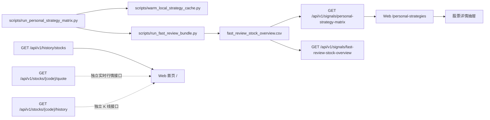

# 个人策略界面接口关系图

> 说明：本文档只描述 Web 个人策略矩阵、股票信息展示和后端读层之间的关系，不定义新的策略阈值。

最后更新：2026-07-11

## 1. 总览

## 2. 当前数据流

1. `scripts/run_personal_strategy_matrix.py` 是推荐生成入口。
2. 它先调用 `scripts/warm_local_strategy_cache.py` 预热 K 线与业绩上下文缓存。
3. 它再调用 `scripts/run_fast_review_bundle.py` 生成 `fast_review_stock_overview.csv`。
4. `/api/v1/signals/personal-strategy-matrix` 读取 CSV，并用 `src/services/personal_strategy_matrix_service.py` 中的 registry 把 `signal_keys / signal_types / triggered_strategies` 映射成个人策略命中关系。
5. Web `/personal-strategies` 只消费矩阵 API 输出，不在前端重新计算策略阈值。
6. 股票详情抽屉复用同一条矩阵数据，展示单票快照、策略命中、图形证据、业绩证据和原始信号键。

## 3. 接口边界

| 入口 | 作用 | 是否实时扫描策略 | 主要消费者 |
| --- | --- | --- | --- |
| `GET /api/v1/signals/personal-strategy-matrix` | 返回个人策略 registry 与股票命中矩阵 | 否 | `/personal-strategies` |
| `GET /api/v1/signals/fast-review-stock-overview` | 返回单票复盘总览，支持 `code` 过滤 | 否 | API 调试、后续单票页 |
| `GET /api/v1/history/stocks` | 返回历史分析中每只股票最新一条摘要 | 否 | Web 首页个股栏 |
| `GET /api/v1/stocks/{code}/quote` | 返回单只股票实时行情 | 否 | 独立行情查询、后续联动 |
| `GET /api/v1/stocks/{code}/history` | 返回单只股票 K 线 | 否 | 独立 K 线查询、后续联动 |
| `POST /api/v1/analysis/analyze` | 提交 AI 分析任务 | 否，走分析流水线 | 首页分析任务 |

## 4. Web 页面责任

`/personal-strategies` 当前负责：

- 按复盘日期和股票代码读取个人策略矩阵。
- 顶部按策略过滤股票。
- 列表展示每只股票命中的策略和压缩证据。
- 点击股票详情后展示更完整的单票字段。

`/personal-strategies` 当前不负责：

- 不重新跑全市场扫描。
- 不重新拉行情或财报补字段。
- 不判断最终买卖动作。
- 不替代首页的 AI 分析任务。

## 5. 后续接入原则

- 如果新增个人策略，优先让策略产物写入 `signal_keys / signal_types / triggered_strategies`，再更新 `src/services/personal_strategy_matrix_service.py` 的 registry。
- 如果详情抽屉需要显示新字段，优先从 `fast_review_stock_overview.csv` 和 `api/v1/schemas/signals.py` 增量追加，避免前端私自派生。
- 如果要在 Web 上触发矩阵生成，应新增明确的后台任务入口，不应让 `GET /personal-strategy-matrix` 承担扫描副作用。
